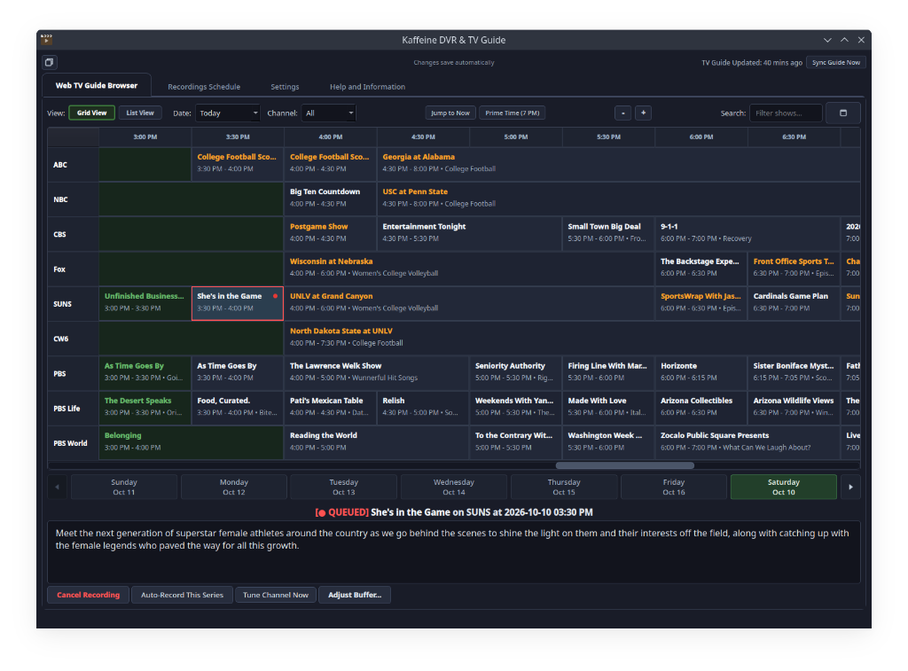
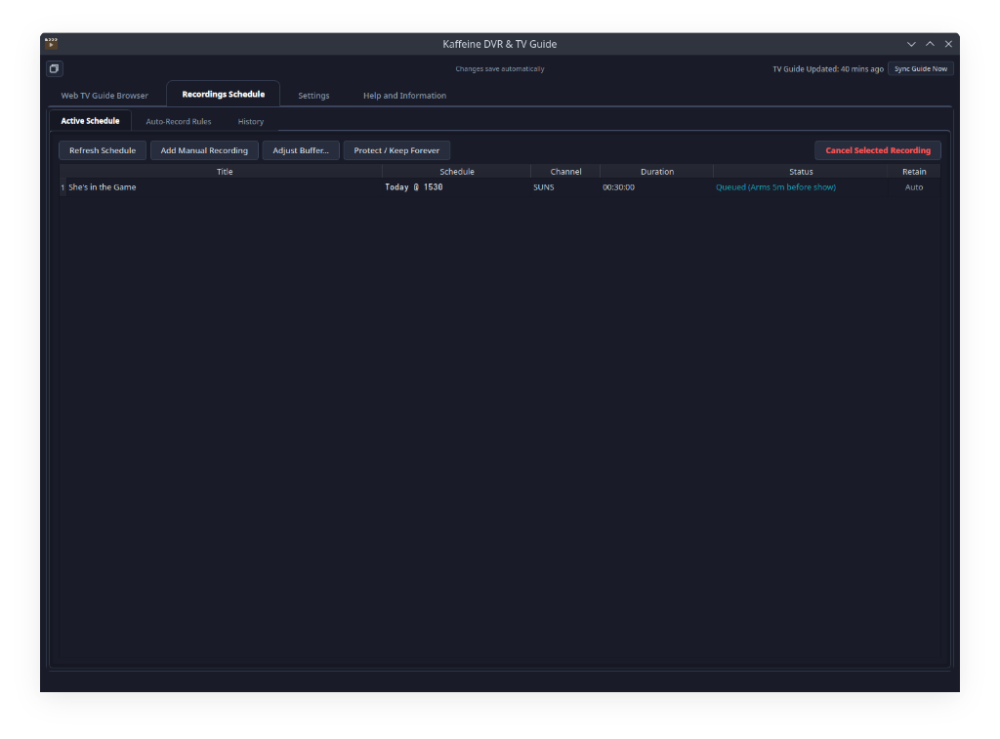
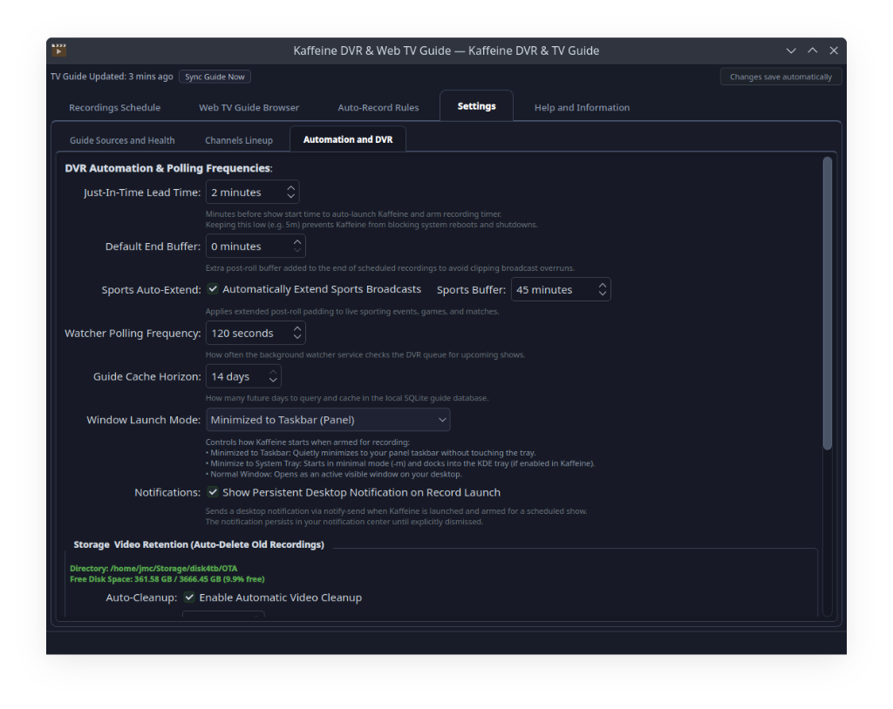
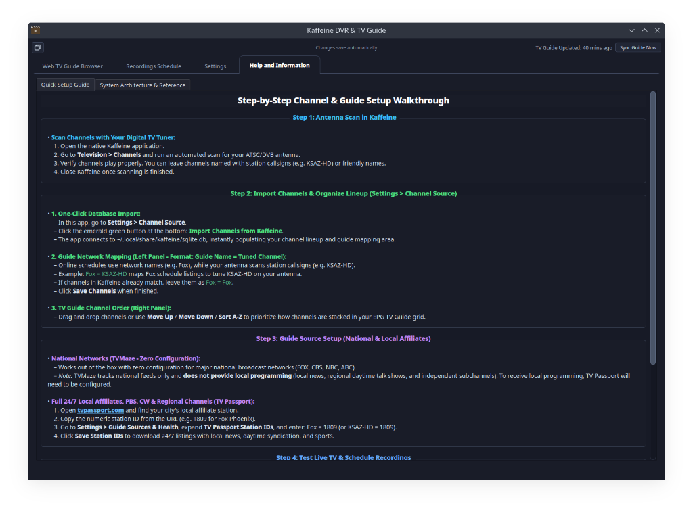

# Kaffeine-DVR-TV-Guide

Modern TV Guide browser, auto-record series scheduler, and Just-In-Time (JIT) DVR recording daemon for Kaffeine on Linux.

---

## Overview

Kaffeine is a powerful digital TV viewer for KDE and Linux desktop environments, but managing recording timers natively presents two common challenges:
1. Native Kaffeine timers inhibit system power management, blocking automated or manual system restarts and shutdowns while timers are pending.
2. In many broadcast markets, electronic program guide (EPG) data over-the-air is sparse, incomplete, or requires continuous manual tuning.

**Kaffeine-DVR-TV-Guide** solves both problems:
- **Zero-Block Power Operations:** Scheduled recordings are held in an external queue database (`recordings_queue.sqlite`). Kaffeine stays completely clean with zero active timers until minutes before showtime.
- **Just-In-Time (JIT) Dispatching:** A lightweight systemd user background service monitors the queue. When a broadcast is about to begin (e.g. 5 minutes before airtime), it launches Kaffeine minimized and arms the timer over D-Bus automatically.
- **Comprehensive EPG Providers:**
  - **TVMaze Cloud API (Free & Automatic)**
  - **TV Passport (Web Station Directory)**
  - **Free Hybrid Mode**
  - **Custom XMLTV Feeds**
  - **Schedules Direct**
- **Dual-Mode TV Guide (Traditional EPG Grid & Searchable List):**
  - **Traditional Grid Layout**
  - **Intuitive Mouse Grab-and-Drag Scrolling**
  - **Genre Color Coding**
  - **Smart Timeline Navigation**
  - **Double-Click to Watch & Smart State**
  - **Adaptive "Watch Live / Tune Channel" Actions**
  - **Direct Startup Launch**
- **Configurable Recording End Buffers (Post-Roll Padding):**
  - **Global Post-Roll Buffer**
  - **Sports Broadcast Auto-Extend**
  - **Per-Rule Custom Overrides**
- **Series Auto-Record Rules**
- **Automated Video Retention & Storage Management:**
  - **Age Retention**
  - **Low-Disk Auto-Purge**
  - **Active Recording & Sidecar Safety**

---

## Screenshots

| Traditional EPG Grid TV Guide View |
|:---:|
| [](docs/screenshots/guide_grid.png) |

| Recordings Schedule (DVR Queue & History) | Automation and DVR Settings |
|:---:|:---:|
| [](docs/screenshots/recordings_schedule.png) | [](docs/screenshots/automation_dvr.png) |

| Help and Information Setup Walkthrough |
|:---:|
| [](docs/screenshots/help_guide.png) |

---

## Installation

### Option 1: AppImage (Recommended - No Setup Required)

The AppImage is completely self-contained. **No Python, PyQt6, or package installation is needed** (all libraries and dependencies are bundled inside).

1. Download the latest `Kaffeine-DVR-TV-Guide-x86_64.AppImage` from [GitHub Releases](https://github.com/PlasmaDrifter/Kaffeine-DVR-TV-Guide/releases/latest).
2. Make it executable and run:
```bash
chmod +x Kaffeine-DVR-TV-Guide-x86_64.AppImage
./Kaffeine-DVR-TV-Guide-x86_64.AppImage
```

> **Tip:** You can also drop it into your favorite AppImage manager such as **AppManager** or **Gear Lever** for automatic desktop menu integration.

---

### Option 2: Automated Installation (From Source)

Use this method if you prefer installing directly into your user Python environment and registering systemd user services.

#### Prerequisites (For Source Installation Only)
- Python 3.9 or newer
- PyQt6 (`sudo apt install python3-pyqt6` on Ubuntu/Debian/Kubuntu, or `pip install PyQt6`)
- Kaffeine (`kaffeine`)
- Standard desktop tools: `systemd`, `notify-send` (optional, for notifications), `kdotool` or `xdotool` (optional, for window minimization)

#### Install Script
Clone the repository and run the automated installer:
```bash
git clone https://github.com/PlasmaDrifter/Kaffeine-DVR-TV-Guide.git
cd Kaffeine-DVR-TV-Guide
./install.sh
```
The script automatically:
1. Installs the Python package with appropriate flags (e.g. `--break-system-packages` where required).
2. Installs the desktop menu launcher into `~/.local/share/applications/`.
3. Installs, enables, and starts the systemd background watcher service (`kaffeine-dvr-watcher.service`).

For local development or editable mode, pass the `-e` flag:
```bash
./install.sh -e
```

### Uninstallation
To remove Kaffeine DVR:
```bash
./uninstall.sh
```
To also purge user configuration and cached database files:
```bash
./uninstall.sh --purge
```

### In-App Updates
You can check for and apply updates directly inside the application under **Settings > Updates and Maintenance**:
- **Automatic Monthly Checks**: Disabled by default. When enabled, Kaffeine DVR checks once every 30 days and displays a green notification badge in the top header with a dismissal button.
- **One-Click Update**: Click **Check for Updates Now** and **Install Update Now** to update and restart without needing terminal commands.

---

## Configuration & Guide Sources

### 1. Channel Source
Open **Settings > Channel Source**. Click **Import Channels from Kaffeine** to read your scanned channels directly from `~/.local/share/kaffeine/sqlite.db`.

Lineup format:
```text
Guide Network Name = Kaffeine Tuned Name
```
Examples:
```text
Fox = Fox
NBC = NBC
CBS = CBS
ABC = ABC
The CW = CW6
```

### 2. TV Guide Sources & Zero-Configuration TVMaze
- **TVMaze (Zero Configuration Required):** Out of the box, national broadcast networks (**FOX, CBS, NBC, ABC, PBS, and The CW**) work automatically with **no accounts, no API keys, and no manual setup**. As soon as the application opens, it downloads 7 days of prime-time listings for all mapped channels.
- **National vs. Local Daytime Programming:** TVMaze catalogs national network programming (evening prime-time dramas, comedies, national sports, and network specials). However, because broadcast networks leave morning, midday, and late-afternoon blocks to local stations, **local news broadcasts, daytime syndicated talk shows, game shows, and independent local subchannels** are not part of TVMaze's national feed.

### 3. TV Passport Setup (24/7 Local Affiliate Coverage & Independent Channels)
To get complete 24/7 continuous schedules with local morning/evening news, daytime talk shows, or independent local channels:
1. Search for your local affiliate station on [tvpassport.com](https://www.tvpassport.com).
2. Note the numeric ID from the station listings URL (for example, `/station/1812/`).
3. Under **Settings > Guide Sources > TV Passport**, enter your station mapping:
   ```text
   NBC = 1812
   ABC = 4163
   Fox = 1809
   CBS = 1813
   CW6 = 11611
   ```
4. Click **Save Station IDs**. The app verifies connectivity and triggers background synchronization immediately. In Free Hybrid mode, TV Passport automatically supersedes TVMaze for those stations to provide full 24/7 local affiliate schedules, while TVMaze continues covering any remaining national channels with zero setup and no duplicates.

---

## CLI & Launch Usage

```bash
# Launch GUI (default when run in desktop graphical session):
kaffeine-dvr

# Show current status, cache stats, and backend health (CLI summary):
kaffeine-dvr --status

# Synchronize 7 days of TV listings
kaffeine-dvr --sync --days 7

# Evaluate auto-record rules and queue matching episodes
kaffeine-dvr --rules

# List current planned queue and active Kaffeine timers
kaffeine-dvr --list

# Run the background watcher daemon in terminal
kaffeine-dvr --watch
```

---

## License

GPL-3.0-or-later. See LICENSE for details.

---

## Community & Discussions

Got questions, setup ideas, or feedback?

* Join our subreddit at [**r/PlasmaDrifterProjects**](https://reddit.com/r/PlasmaDrifterProjects) to discuss updates, get support, and share configurations.
* Contact directly via email at [**plasmadrifter121@gmail.com**](mailto:plasmadrifter121@gmail.com).
